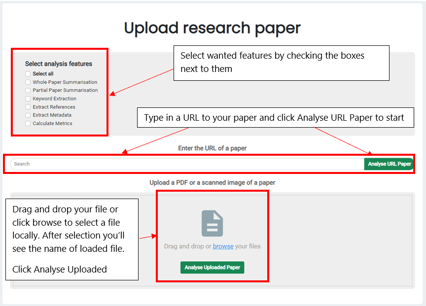

# User Manual

## Project Documents
1. [README.md](../readme.md)
2. [Deployment Guide](DeploymentGuide.md)
3. User Manual **(YOU ARE HERE)**
4. Docs
5. [API](Endpoint.md)

## How to use KONLA?
You can use KONLA in **two** different ways:

1. If you are a researcher looking for a **tool to analyse your paper**, you can use our intuitive user interface (see Using KONLA via user interface)

2. If you are a researcher or developer who wants to **make use of the technology behind KONLA in their software or other setting**, you can use our backend API (see Using KONLA via backend API)

## Using KONLA via user interface

Navigate to the website hosting KONLA service. You should see a container titled “Upload research paper”.

#### Selecting features
Select the features of the system you want to use by checking the corresponding boxes. You can also click select all to select all of the features at once.
#### Uploading document & starting analysis
After you selected the features you should upload your .pdf paper. You can do that by entering a URL link of a paper and clicking “Analyse URL Paper” or you can upload your local .pdf file using the grey area at the bottom of the container. Drag and drop your file or click “browse” to select a file from your local file system.  After you selected one click the “Analyse Uploaded Paper” button to start the analysis process.

#### After upload
You will see a new view after a few seconds. The features you selected will appear on the left side and they will be color-coded:

🟡 Yellow – Your feature is still being run in the background. Please wait.

🟢 Green – Your feature has finished. You can click on the block to see the results.

🔴 Red – An error occurred while trying to run this feature. Try again or report an issue.

## Using KONLA via backend API
Please, refer to [API Documentation](Endpoint.md) to call desired endpoints.